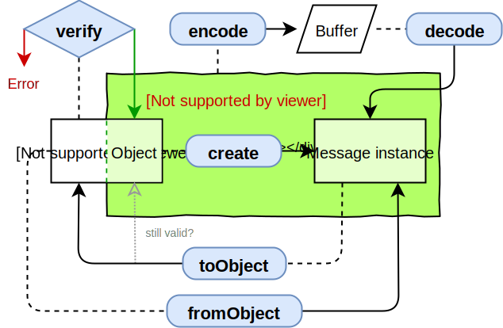

### Protocol Buffers

---

一种序列化结构数据的方法，可用于通信协议、数据存储，类比 XML、JSON

 [文档](https://developers.google.com/protocol-buffers/docs/overview)   [代码](https://github.com/protocolbuffers/protobuf) 

**特点**：语言无关，平台无关，高效，二进制编码，会使调试复杂化

##### 使用

1. **创建.proto文件，定义消息格式**

   message类型，实体结构，由多个字段组成。包括字段规则、数据类型、字段名、字段编号、默认值

   ```protobuf
   message xxx {
   	optional int32 id = 1 [default = 10];
   	字段规则 类型 名称 = 字段编号;
   	// 字段规则：required -> 1 次
   	// 字段规则：optional -> 0 次或 1 次
   	// 字段规则：repeated -> 任意多次（包括 0）
   	// 字段编号：1 ~ 536870911（除去 19000 到 19999 之间的数字）
   }
   ```

   **类型表格：**

   | .proto Type |                            Notes                             | C++ Type | Java Type  | Python Type[2] | Go Type  |
   | :---------: | :----------------------------------------------------------: | :------: | :--------: | :------------: | :------: |
   |   double    |                                                              |  double  |   double   |     float      | *float64 |
   |    float    |                                                              |  float   |   float    |     float      | *float32 |
   |    int32    | 使用可变长度编码。编码负数的效率低 - 如果你的字段可能有负值，请改用 sint32 |  int32   |    int     |      int       |  *int32  |
   |    int64    | 使用可变长度编码。编码负数的效率低 - 如果你的字段可能有负值，请改用 sint64 |  int64   |    long    |  int/long[3]   |  *int64  |
   |   uint32    |                       使用可变长度编码                       |  uint32  |   int[1]   |  int/long[3]   | *uint32  |
   |   uint64    |                       使用可变长度编码                       |  uint64  |  long[1]   |  int/long[3]   | *uint64  |
   |   sint32    | 使用可变长度编码。有符号的 int 值。这些比常规 int32 对负数能更有效地编码 |  int32   |    int     |      int       |  *int32  |
   |   sint64    | 使用可变长度编码。有符号的 int 值。这些比常规 int64 对负数能更有效地编码 |  int64   |    long    |  int/long[3]   |  *int64  |
   |   fixed32   |    总是四个字节。如果值通常大于 228，则比 uint32 更有效。    |  uint32  |   int[1]   |  int/long[3]   | *uint32  |
   |   fixed64   |    总是八个字节。如果值通常大于 256，则比 uint64 更有效。    |  uint64  |  long[1]   |  int/long[3]   | *uint64  |
   |  sfixed32   |                         总是四个字节                         |  int32   |    int     |      int       |  *int32  |
   |  sfixed64   |                         总是八个字节                         |  int64   |    long    |  int/long[3]   |  *int64  |
   |    bool     |                                                              |   bool   |  boolean   |      bool      |  *bool   |
   |   string    |       字符串必须始终包含 UTF-8 编码或 7 位 ASCII 文本        |  string  |   String   | str/unicode[4] | *string  |
   |    bytes    |                     可以包含任意字节序列                     |  string  | ByteString |      str       |  []byte  |

2. **编译 .proto 文件生成读写接口**

3. **调用接口实现序列化、反序列化以及读写消息**

#### protobufjs

纯JavaScript实现，支持Node.js和浏览器的TypeScript，容易使用速度快，可以直接反射`.proto`文件，不需要生成任何文件。解析.proto文件，构建Message类，编码解码。

 [文档](https://protobufjs.github.io/protobuf.js/)   [代码](https://github.com/protobufjs/protobuf.js) 

```sh
# 安装
$> npm install protobufjs
```

有效消息

